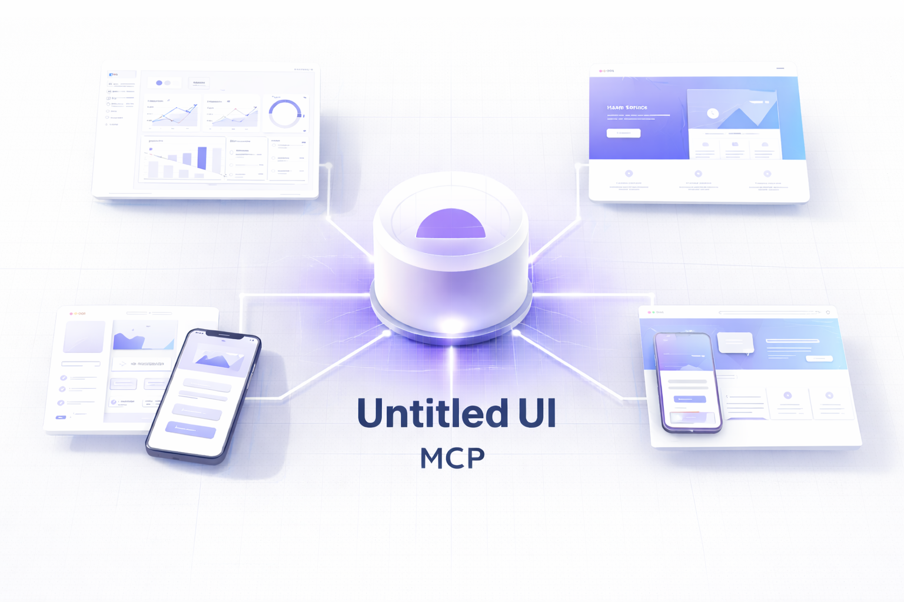

# UntitledUI MCP



MCP server that lets AI agents fetch real UntitledUI components instead of generating UI from scratch.

## Why

When you ask an AI to build UI, it generates code based on patterns it's seen. This MCP gives your AI direct access to professionally designed components — the same ones you'd use manually.

## Setup

### 1. Authenticate with UntitledUI

```bash
npx untitledui@latest login
```

### 2. Add MCP to your tool

**Claude Code:**
```bash
claude mcp add untitledui -- npx untitledui-mcp
```

**Cursor / VS Code** — add to `.cursor/mcp.json`:
```json
{
  "mcpServers": {
    "untitledui": {
      "command": "npx",
      "args": ["untitledui-mcp"]
    }
  }
}
```

### 3. Verify

```bash
npx untitledui-mcp --test
```

## How It Works

Your AI gets these tools:

| Tool | What it does |
|------|--------------|
| `search_components` | Find components by name or description |
| `list_components` | Browse a category |
| `get_component_with_deps` | Fetch component + all dependencies |
| `get_component` | Fetch component only |
| `get_example` | Get complete page template |

### Example: Add a modal

```
You: "Add a settings modal"

AI searches → finds application/modals/settings-modal
AI fetches → gets modal + button, input, select base components
AI adds → places files in your project with correct imports
```

### Example: Browse options

```
You: "What sidebar variants are there?"

AI calls list_components { type: "application", subfolder: "sidebars" }
→ Returns all sidebar options for you to choose from
```

### Example: Start from template

```
You: "Set up a dashboard layout"

AI calls get_example { name: "application" }
→ Returns complete dashboard with sidebar, header, and sample pages
```

## Response Format

```json
{
  "primary": {
    "name": "settings-modal",
    "files": [{ "path": "settings-modal.tsx", "code": "..." }],
    "baseComponents": ["button", "input", "select"]
  },
  "baseComponents": [
    { "name": "button", "files": [...] },
    { "name": "input", "files": [...] }
  ],
  "allDependencies": ["@headlessui/react", "clsx"]
}
```

## Requirements

- Node.js 18+
- UntitledUI Pro license

## Credits

[UntitledUI](https://www.untitledui.com) is created by [Jordan Hughes](https://jordanhughes.co).

- [Twitter/X](https://x.com/jordanphughes)
- [Dribbble](https://dribbble.com/jordanhughes)
- [UntitledUI on X](https://x.com/UntitledUI)

## License

MIT
